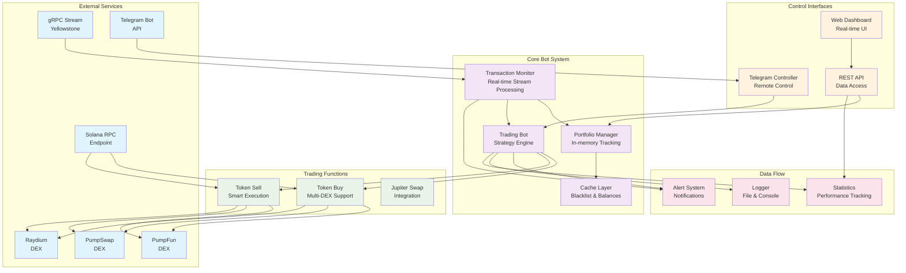

# Advanced Solana Trading Bot

A sophisticated, high-performance Solana trading bot that automatically follows target wallets and executes trades across multiple DEX platforms. Built with real-time transaction monitoring, intelligent risk management, and comprehensive control interfaces.

## 🌟 Key Features

### 🚀 **Automated Trading**
- **Real-time Transaction Monitoring**: Uses gRPC streams to monitor target wallets instantly
- **Multi-DEX Support**: PumpFun, PumpSwap, Raydium LaunchLab, Raydium CPMM
- **Dynamic Position Sizing**: Percentage-based buy amounts that scale with target wallet activity
- **Intelligent Risk Management**: Advanced stop-loss, trailing stops, and position management

### 📊 **Advanced Analytics**
- **Real-time Dashboard**: Web-based interface with live portfolio tracking
- **Performance Metrics**: Detailed P&L tracking, success rates, and trading statistics
- **Portfolio Management**: Complete transaction history and token tracking
- **Risk Monitoring**: Real-time balance checks and alert systems

### 🤖 **Telegram Integration**
- **Remote Control**: Start/stop bot from anywhere via Telegram
- **Live Notifications**: Buy/sell alerts, balance warnings, and error notifications
- **Interactive Interface**: Button-based controls and status monitoring
- **Customizable Alerts**: Configure which notifications you want to receive

### ⚡ **High Performance**
- **Zero-Latency Trading**: Sub-second execution using gRPC streams
- **Smart Caching**: In-memory caching for optimal performance
- **Cooldown Management**: Prevents spam trading and duplicate transactions
- **Error Recovery**: Automatic retry logic and graceful error handling

## 🏗️ System Architecture



## 🚀 Quick Start

### Prerequisites
- Node.js 16+ 
- Solana wallet with private key
- RPC endpoint (Helius, QuickNode, or similar)
- Telegram bot token (optional)

### Installation

1. **Clone the repository**
   ```bash
   git clone <repository-url>
   cd solana-copy-trading-bot 
   ```

2. **Install dependencies**
   ```bash
   npm install
   ```

3. **Configure environment**
   ```bash
   cp .env.ex .env
   # Edit .env with your configuration
   ```

4. **Start the bot**
   ```bash
   npm start
   ```

5. **Access dashboard** (optional)
   ```bash
   npm run dashboard
   # Open http://localhost:3000
   ```

## ⚙️ Configuration

### Required Environment Variables

```env
# Solana Configuration
RPC_URL=https://your-rpc-endpoint
PRIVATE_KEY=your_wallet_private_key
PUB_KEY=your_wallet_public_key

# Trading Configuration
BUY_AMOUNT=0.1                    # Fixed buy amount in SOL
BUY_AMOUNT_PERCENTAGE=1.0         # Percentage of target wallet's SOL change (optional)
TARGET_WALLET=wallet1,wallet2     # Comma-separated target wallets

# gRPC Configuration
GRPC_ENDPOINT=your_grpc_endpoint
GRPCTOKEN=your_grpc_token

# Telegram (Optional)
TELEGRAM_BOT_TOKEN=your_bot_token
```

### Advanced Configuration

```env
# Risk Management
LIMIT_BALANCE=0.1                 # Minimum balance to start trading
SLIPPAGE_BPS=50                   # Slippage tolerance (0.5%)

# Performance
MAX_RETRIES=3                     # Maximum retry attempts
RETRY_DELAY=1000                  # Delay between retries (ms)

# Dashboard
DASHBOARD_PORT=3000               # Web dashboard port
```

## 📱 Usage

### Basic Commands

```bash
# Start the trading bot
npm start

# Start with dashboard
npm run dashboard

# Development mode (with auto-restart)
npm run dev
```

### Telegram Commands

- `/start` - Main control panel
- `/status` - Check bot status and balance
- `/balance` - View wallet balance
- `/alerts` - Configure notifications
- `/help` - Show all commands

### Dashboard Features

- **Real-time Monitoring**: Live portfolio and performance data
- **Manual Trading**: Buy/sell tokens directly from the interface
- **Portfolio Management**: View all positions and transaction history
- **Performance Analytics**: Detailed trading statistics and P&L tracking

## 🔧 Advanced Features

### Dynamic Position Sizing

The bot can automatically adjust buy amounts based on target wallet activity:

```env
# Buy 50% of target wallet's SOL change
BUY_AMOUNT_PERCENTAGE=0.5

# Buy 200% of target wallet's SOL change (2x leverage)
BUY_AMOUNT_PERCENTAGE=2.0
```

### Multi-DEX Trading

Supports multiple DEX platforms:
- **PumpFun**: Bonding curve trading
- **PumpSwap**: AMM-based trading
- **Raydium LaunchLab**: Launchpad tokens
- **Raydium CPMM**: Constant product market maker

### Risk Management

- **Stop Loss**: Automatic position closure on losses
- **Trailing Stops**: Dynamic stop-loss adjustment
- **Position Limits**: Maximum position size controls
- **Balance Monitoring**: Automatic trading halt on low balance

## 📊 Performance Monitoring

### Real-time Metrics

- **Active Bots**: Number of running trading bots
- **Portfolio Value**: Total value of all positions
- **Success Rate**: Percentage of profitable trades
- **P&L Tracking**: Real-time profit/loss monitoring

### 🎯 Performance Showcase

Recent successful trades demonstrating the bot's effectiveness:

#### **C6ZSK5MpqjvEAXh7XHfQeRh3PwvRuqoCKJk8Yufypump**
- **Profit**: +$12.25 (+45.36%)
- **Transactions**:
  - [Target Wallet Buy](https://solscan.io/tx/4Go5MWQKom5XYkD6Mofxqw8DAjZhxbUywr3eVcxoejbsTgLyGjfAoy2wowHxjhNfnY9rw1ws4s2VznMCBskodiG3)
  - [Bot Buy](https://solscan.io/tx/2SNZpcerg51f7oAQgaGNgDzA518oDbmjDkVUcwNDFFefwSnL3ChLVJehtjXNvAfvJMsf1pPtSs8HPjjj6usAyT6j)
  - [Target Wallet Sell](https://solscan.io/tx/36g3MSD2kSMH77Rd569GbpeHRW9MvR5Y1hTDyGtwsXPNynwXw1Z6F4whAPbsQPJBXDMpvQw2xzgyBgUN4ByEbDAh)
  - [Bot Sell](https://solscan.io/tx/4ZN9uRzAMhSLUrJheEaqesCss32kuQBYHtxrjn4on9fmox3k19mwDJzqbcvgWZUkaSJXndhoGJGWjuHYT5ZmDLbC)

#### **AzTtHgN6aC3K5LtGDvBNCgPQtYPa6DCjcGyrfZFUpump**
- **Profit**: +$5.44 (+57.66%)
- **Transactions**:
  - [Target Wallet Buy](https://solscan.io/tx/4JhQspi5JckD5ow2AzJ6wTNnaJ4DQVwdfjzao5NPdjgeB5HbhJfm9zQjEX8ZLgXLYTLzbnS5uRhGFd9AhxmSKzQv)
  - [Bot Buy](https://solscan.io/tx/2kCFmwwPVTs24zW86XDQMCxtGQqyx5NV1CyCmRzHJjd5Ki52sLemjscKUqYfXbx9o1rJzjyejvrMbXZAkyAx9GhK)
  - [Target Wallet Sell](https://solscan.io/tx/ENY5k2N9G4BDVkBjiUsbo4ewFrenbAciqvNA7Q7eXAR5TC9ivJrPf8GCXZUav91biQzZYgwu5RSvQD5mPgh2xfm)
  - [Bot Sell](https://solscan.io/tx/adNKo7sMQhMUm9gFDPBPbqdTzGtZwSVsXV3FQFVMP7rtqsGGiH2CngrJQBjxEFScqnx3F7QZ1ZA9s76gdLspq2o)

#### **6iiTw75295gt9j29PCLVvFGNxdk3xfb4sPSH4G6Xpump**
- **Profit**: +$18.2 (+166.3%)
- **Transactions**:
  - [Target Wallet Buy](https://solscan.io/tx/2EXYt6fJMbgpEKtATJJKDGFPJPxGpVUcRcxWEArdd6zWEFupHCW5XdRZJRHA9AWyT4turm8RXo4FY7Wn7Yci6Yjr)
  - [Bot Buy](https://solscan.io/tx/2ZaxkizUj7fciGtwZnPFWzbJRMX9NuHCai7X652XvyemsugVpffmp1bQptAg2cCGox9V8JtFpsH648JEHCfeCj88)

#### **A6sxxPN8uksAHxoPtMEoArn9nz5nrP3gKNpDXm8Tpump**
- **Profit**: +$3.68 (+40.51%)
- **Transactions**:
  - [Target Wallet Buy](https://solscan.io/tx/3tybz8GhejnAD9yRB2Gvn2XH2Jb1sGsw9N5xQTJC9wifg9WERd85d4AszfV5kJz5agPXiDXmWMyDfNqzD1E3pFoB)
  - [Bot Buy](https://solscan.io/tx/3tq6kvBmeQ1jgASnU3X1P4HcKyMwMg8wDH8ZubHpE3M3CAtPUUxP5H3L8XRzU837Ssys3ESjXR1fsCn3BGxWEqL9)

> **Note**: These are real trading results from the bot following target wallets. All transactions are verifiable on Solana blockchain explorers.

### Logging and Alerts

- **Console Logging**: Detailed transaction logs
- **File Logging**: Persistent log storage
- **Telegram Alerts**: Real-time notifications
- **Error Tracking**: Comprehensive error logging

## 🛡️ Security Features

- **Private Key Protection**: Secure key management
- **Input Validation**: All inputs are validated and sanitized
- **Rate Limiting**: Protection against rapid-fire requests
- **Error Handling**: Graceful error recovery and logging

## 🔄 Integration

### Supported Platforms

- **Solana Mainnet**: Full production support
- **Devnet**: Testing and development
- **Custom RPC**: Any Solana RPC endpoint

### API Endpoints

- `GET /api/status` - Bot status and health
- `GET /api/tokens` - Portfolio tokens
- `GET /api/transactions` - Transaction history
- `GET /api/performance` - Trading metrics

## 🚨 Troubleshooting

### Common Issues

1. **Bot won't start**
   - Check wallet balance (minimum 0.1 SOL)
   - Verify RPC endpoint connectivity
   - Ensure private key is correct

2. **No trades executing**
   - Check target wallet configuration
   - Verify gRPC endpoint and token
   - Monitor console logs for errors

3. **High slippage**
   - Increase `SLIPPAGE_BPS` value
   - Check market liquidity
   - Consider smaller position sizes

### Debug Commands

```bash
# Manual status check
kill -SIGUSR1 <process_id>

# Strategy debug
kill -SIGUSR3 <process_id>

# Balance check
kill -SIGUSR2 <process_id>
```

## 📈 Performance Optimization

### Recommended Settings

- **RPC Endpoint**: Use premium RPC for better performance
- **gRPC Stream**: Ensure stable connection for real-time data
- **Memory**: Allocate sufficient RAM for caching
- **Network**: Use low-latency connection for faster execution

### Monitoring

- Monitor console logs for performance metrics
- Use dashboard for real-time monitoring
- Set up Telegram alerts for important events
- Regular balance and performance checks

## 🔮 Future Enhancements

- **Advanced Charting**: Technical analysis integration
- **Multi-Wallet Support**: Manage multiple trading wallets
- **Strategy Backtesting**: Historical performance testing
- **Mobile App**: Native mobile interface
- **API Trading**: REST API for external integrations

## 📞 Support & Contact

### Contact Information
- **Telegram**: [@mortdeus](https://t.me/mortdeus)
- **Repository**: Private repository always available to land 0block

### Getting Help

1. Check the troubleshooting section
2. Review console logs for error messages
3. Verify your configuration
4. Contact support via Telegram

## 📄 License

This project is proprietary software. All rights reserved.

---

**⚠️ Disclaimer**: Trading cryptocurrencies involves substantial risk of loss. This software is provided for educational purposes only. Use at your own risk.

**🚀 Happy Trading!** May your trades be profitable and your stops be tight!
